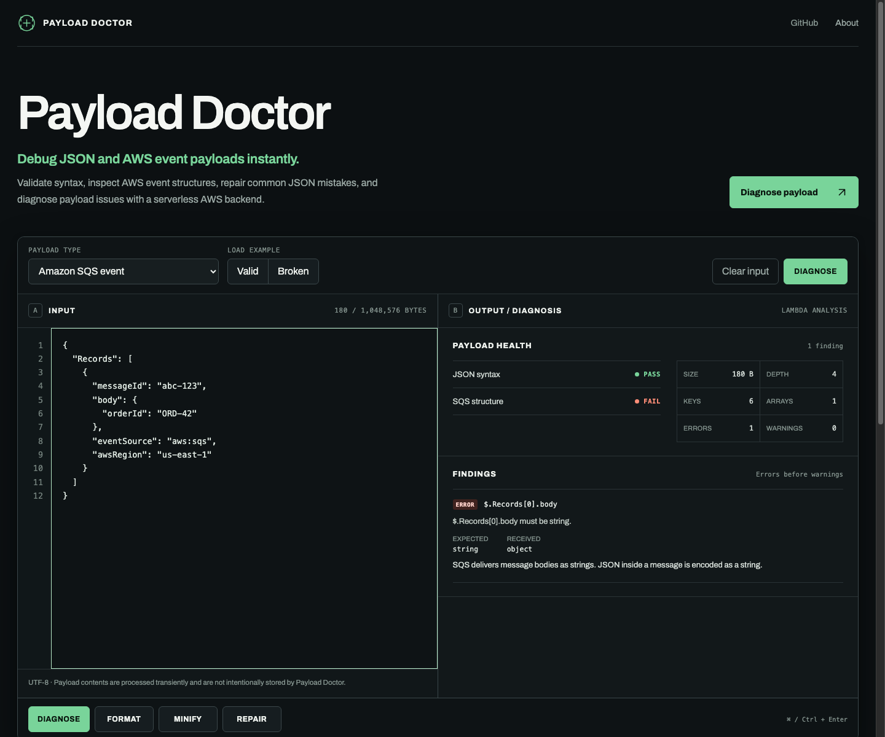
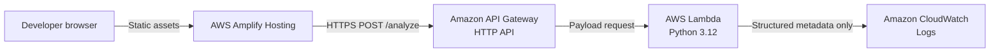

# Payload Doctor

**Debug JSON and AWS event payloads instantly.**

[](https://github.com/varad-more/payload-doctor/actions/workflows/ci.yml)
[](LICENSE)

**[Open the live application →](https://main.d3hgtl2mzv6vqq.amplifyapp.com)**

Payload Doctor is a small serverless developer tool for validating, diagnosing, formatting, minifying, and conservatively repairing JSON. Unlike a generic formatter, it also checks the useful structure of API Gateway REST API proxy v1.0, SQS, SNS, and EventBridge events. Analysis runs in AWS Lambda; the browser is only the editor and result viewer.



## Features

- Strict JSON parsing with human-readable line, column, position, and source context
- Generic JSON accepts objects, arrays, strings, numbers, booleans, and `null`
- Deterministic payload health metrics: UTF-8 bytes, nesting depth, keys, arrays, and scalar values
- Two-space formatting and compact minification with byte savings
- Conservative repair of trailing commas, single-quoted strings, simple unquoted keys, and Python-style value literals
- Structural checks for API Gateway REST API proxy payload v1.0, Amazon SQS, Amazon SNS, and Amazon EventBridge events
- JSON Schema validation with stable JSON paths and schema self-validation
- Valid and intentionally broken built-in examples for every payload type
- Keyboard workflow (`Ctrl`/`Cmd` + `Enter`), responsive layout, and accessible status summaries
- Structured CloudWatch telemetry that excludes raw payload content

## Architecture



AWS SAM provisions the HTTP API, Lambda function, least-privilege basic logging permissions, API access log group, throttling, timeout, and configurable CORS allowlist. See [the architecture notes](docs/architecture.md) for request flow and security boundaries.

## 30-second demo

1. Select **Amazon SQS event**, load **Broken**, and click **Diagnose**.
2. Point out that JSON syntax passes while SQS structure fails with one finding at `$.Records[0].body`: expected `string`, received `object`.
3. Select **Generic JSON**, load **Broken**, and click **Repair**.
4. Show the seven conservative edits and copy the strictly valid formatted output.

## Local development

Prerequisites: Python 3.12, Node.js 18 or newer, npm, and AWS SAM CLI for a local HTTP endpoint. SAM local also needs a Docker-compatible runtime; the deployed architecture does not use containers.

Backend setup and tests:

```bash
cd backend
python3.12 -m venv .venv
source .venv/bin/activate       # Windows PowerShell: .venv\Scripts\Activate.ps1
pip install -r requirements-dev.txt
pytest
```

Start the Lambda API locally from the repository root:

```bash
sam build --template-file infrastructure/template.yaml
sam local start-api --template .aws-sam/build/template.yaml
```

Create the frontend environment file and start Vite in another terminal:

```bash
cp frontend/.env.example frontend/.env
npm --prefix frontend install
npm --prefix frontend run dev
```

`frontend/.env.example` points `VITE_API_BASE_URL` to SAM at `http://127.0.0.1:3000`. It may instead point to a deployed API Gateway base URL. Restart Vite after changing environment variables.

## Tests and checks

```bash
(cd backend && .venv/bin/pytest -q)
(cd frontend && npm run build)
sam validate --lint --template infrastructure/template.yaml
sam build --template infrastructure/template.yaml
```

The frontend build runs TypeScript checking before Vite's production bundle. The backend suite covers valid and malformed JSON, Unicode byte counts, formatting, minification, every supported repair, unsafe repair refusal, all four AWS event validators, additional-field tolerance, JSON Schema behavior, input limits, Lambda responses, and the two demo scenarios. The same checks run publicly in [GitHub Actions](.github/workflows/ci.yml) on pushes and pull requests.

## Deploy the backend with AWS SAM

From a configured AWS CLI session:

```bash
cd infrastructure
sam build
sam deploy --guided
```

During the guided deployment:

- choose a stack name such as `payload-doctor`
- choose the target AWS Region
- set `AllowedOrigins` to the exact comma-separated frontend origins, without spaces—for example `http://localhost:5173,https://main.example.amplifyapp.com`
- allow SAM to create the IAM role
- save the configuration if desired (local `samconfig.toml` is gitignored)

After deployment, copy the `ApiUrl` stack output. The URL has no stage suffix because the HTTP API uses the `$default` stage.

Useful operational commands:

```bash
aws cloudformation describe-stacks \
  --stack-name payload-doctor \
  --query 'Stacks[0].Outputs[?OutputKey==`ApiUrl`].OutputValue' \
  --output text

sam logs --stack-name payload-doctor --name AnalyzerFunction --tail
```

## Deploy the frontend with AWS Amplify

1. Push this repository to GitHub.
2. In AWS Amplify Hosting, create an app and connect the repository and branch.
3. Amplify detects the root [`amplify.yml`](amplify.yml); it installs and builds the `frontend` package.
4. In **Hosting → Environment variables**, add `VITE_API_BASE_URL` with the SAM `ApiUrl` value.
5. Optionally add `VITE_GITHUB_URL` with the public repository URL.
6. Deploy the branch.
7. If the Amplify domain was not known during the first backend deployment, update the SAM stack with that exact HTTPS origin:

   ```bash
   cd infrastructure
   sam deploy --parameter-overrides \
     AllowedOrigins="http://localhost:5173,https://main.example.amplifyapp.com"
   ```

8. Confirm the browser preflight and `POST /analyze` succeed from the Amplify domain.

The frontend environment variables are public build-time configuration, not secrets. Never place AWS credentials in them.

## Environment variables

| Variable | Required | Purpose |
| --- | --- | --- |
| `VITE_API_BASE_URL` | Yes | API Gateway base URL, without a trailing slash |
| `VITE_GITHUB_URL` | No | Public repository link shown in the header |

The Lambda needs no application secrets or runtime environment variables.

## Privacy and security

> Payload contents are processed transiently and are not intentionally stored by Payload Doctor.

- Raw payloads and schemas are never intentionally logged.
- CloudWatch application logs contain request ID, operation, payload type, UTF-8 payload size, duration, outcome, and failure category only.
- Payload content is limited to 1 MiB; schema content is limited to 256 KiB in both UI and Lambda.
- Input is parsed as data only. The backend performs no evaluation, execution, shell calls, dynamic imports, or input-derived filesystem writes.
- JSON Schema references resolve only within the supplied schema; remote `$ref` retrieval is disabled.
- API Gateway CORS uses an explicit deployment parameter rather than a wildcard.
- The Lambda role grants only standard CloudWatch log delivery permissions.
- No payload database, credentials, account system, or browser storage is used.

This public tool cannot determine whether pasted data is sensitive. For strict data-governance environments, deploy it into an approved AWS account and use organization-appropriate API controls.

## Project structure

```text
.
├── frontend/                 React, TypeScript, Vite UI
│   └── src/
│       ├── components/       Editor and diagnosis report
│       ├── examples/         Valid and broken payloads
│       ├── services/         API client
│       └── types/            Request/response contracts
├── backend/
│   ├── analyzer/             Strict JSON, metrics, repair, schema
│   ├── validators/           AWS event structural validators
│   ├── tests/                Pytest suite
│   └── app.py                Lambda handler and API contract
├── infrastructure/
│   └── template.yaml         AWS SAM stack
├── .github/workflows/ci.yml  Public test and build checks
├── docs/
│   └── architecture.md
├── PRODUCT.md                Durable product truth
├── DESIGN.md                 Shipped interface system
└── amplify.yml               Amplify build configuration
```

## API contract

`POST /analyze`

```json
{
  "operation": "diagnose",
  "payloadType": "sqs",
  "content": "{\"Records\":[]}",
  "schema": null
}
```

Operations are `diagnose`, `format`, `minify`, `repair`, and `schema_validate`. Payload types are `generic`, `api_gateway`, `sqs`, `sns`, and `eventbridge`. Invalid JSON returns HTTP `422`; invalid requests return `400`; size violations return `413`. Expected analysis findings return HTTP `200` with `success: true` and populated `errors` or `warnings`.

## Limitations

- AWS checks intentionally validate useful payload structure, not every service-side constraint or every event version.
- Repair handles only the documented, unambiguous cases. It refuses incomplete strings, missing delimiters, unknown bare values, and malformed numbers.
- JSON Schemas must bundle referenced definitions; remote `$ref` URLs are not fetched.
- API Gateway validation targets REST API proxy payload v1.0, rejects HTTP API payload v2.0 explicitly, and permits optional fields.
- There is no authentication, payload history, sharing, or persistence.
- Public API throttling is a basic cost guard, not abuse prevention for a high-traffic production service.

## Future improvements

Only add these when actual usage warrants them: optional API protection with AWS WAF, more AWS event types, richer editor syntax highlighting, and a deployed-endpoint smoke check after release. Authentication, databases, AI repair, and payload history are deliberately out of scope.

## License

[MIT](LICENSE)
