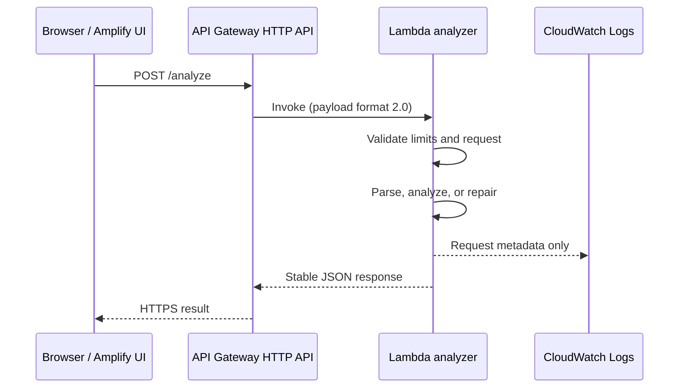

# Payload Doctor architecture

## Runtime flow

1. AWS Amplify serves the compiled React/Vite application.
2. The browser sends the selected operation, payload type, payload text, and optional schema to `POST /analyze` over HTTPS.
3. API Gateway enforces the configured origin allowlist and basic route throttling, then invokes one Python 3.12 Lambda.
4. Lambda validates request shape and UTF-8 byte limits before parsing. All parsing, metrics, repairs, AWS structure checks, and JSON Schema checks happen in Lambda.
5. Lambda returns a stable JSON response. It does not write the payload to storage.
6. Lambda and API Gateway emit operational metadata to CloudWatch Logs. Raw payload and schema content are excluded.

## Backend boundaries

`app.py` owns the public contract, request validation, response status, and metadata logging. `analyzer/` contains strict JSON operations, metrics, conservative repair, and JSON Schema handling. `validators/` contains one small validator per supported AWS event type. The API Gateway validator targets REST API proxy payload v1.0 and explicitly rejects HTTP API payload v2.0; the other validators also accept additional properties so AWS can extend payloads without breaking the tool.

## Repair safety model

Repair is a lexical transformation, not code execution. It only attempts four known changes outside existing double-quoted strings:

- replace a trailing comma immediately before `}` or `]`
- convert a closed single-quoted string with recognized escapes
- quote a simple identifier in an object-key position
- convert `True`, `False`, or `None` in an obvious value position

The candidate is accepted only if Python's strict JSON parser can parse it afterward. A valid payload is returned unchanged. Unknown or incomplete syntax is refused.

JSON Schema validation uses an empty reference registry. Local references such as `#/$defs/id` work, while remote `$ref` retrieval is rejected to prevent user-controlled outbound requests.

## Deployment controls

- Lambda: 256 MB, 10-second timeout, x86_64, Python 3.12
- API Gateway: 25 requests/second steady-state, burst 50, explicit CORS origins
- Payload limit: 1 MiB of UTF-8 content
- Schema limit: 256 KiB of UTF-8 content
- API access-log retention: 14 days
- Lambda permissions: CloudWatch log creation and delivery only

Payload Doctor has no DynamoDB table, S3 payload bucket, Cognito pool, VPC, container, or secret.
